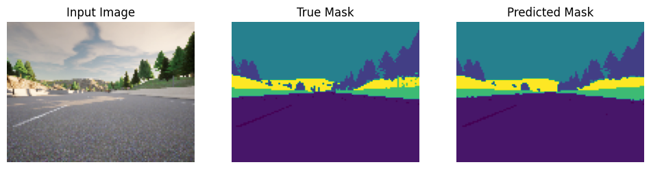
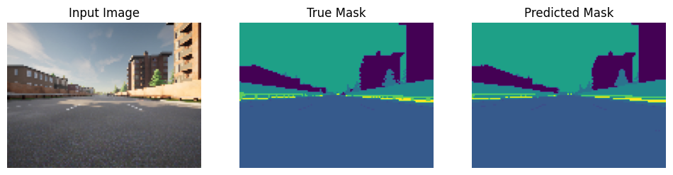

#### Overview

Built a U-net model to predict a label for each pixel for each input image, and in turn the mask for the image.

#### Model

The model takes in images, preprocesses them, by normalising the values to be between 0 and 1. The U-net model consists of an encoder and decoder block. The encoder uses regular CNN to downsample the image and extract features (spatial information) from it. Skip connections are added to retain the information and check overffiting.
The output of the encoder block serves as the input for the decoder block. The skip connections sends information to every upsampling layer, between corresponding encoder and decoder blocks.

Results after training;
<picture>
 <source media="(prefers-color-scheme: dark)" srcset="output.png">
 <source media="(prefers-color-scheme: light)" srcset="output.png">
 
</picture>

<picture>
 <source media="(prefers-color-scheme: dark)" srcset="1output.png">
 <source media="(prefers-color-scheme: light)" srcset="1output.png">
 
</picture>

